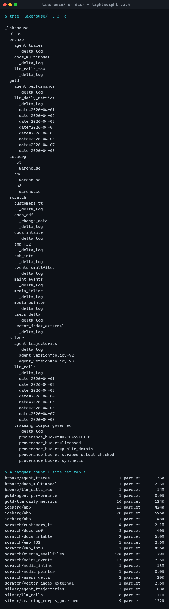

# Evidence 1 — `tree _lakehouse/` (lightweight path)



Windows 11 · Python 3.11.8 · deltalake 1.6.2 · pyiceberg 0.11.1 · duckdb 1.5.5 · polars 1.43.2 · pyarrow 25.0.1  
Captured 2026-08-18 05:40 UTC, immediately after a green `run-all`.

The partition directories are the part worth looking at:

* `gold/llm_daily_metrics/date=2026-04-01 … -08` — 8 days (NB4 needs ≥ 7)
* `silver/agent_trajectories/agent_version=policy-v2 / -v3` — NB8 Silver partitioning
* `silver/training_corpus_governed/provenance_bucket=…` — all four Art. 10
  buckets plus `UNCLASSIFIED`, as partitions on disk
* `scratch/events_smallfiles` — 324 parquet files, the small-file problem NB2
  and NB6 exist to fix

Full text below.

```
$ tree _lakehouse/ -L 3 -d

_lakehouse
  blobs
  bronze
    agent_traces
      _delta_log
    docs_multimodal
      _delta_log
    llm_calls_raw
      _delta_log
  gold
    agent_performance
      _delta_log
    llm_daily_metrics
      _delta_log
      date=2026-04-01
      date=2026-04-02
      date=2026-04-03
      date=2026-04-04
      date=2026-04-05
      date=2026-04-06
      date=2026-04-07
      date=2026-04-08
  iceberg
    nb5
      warehouse
    nb6
      warehouse
    nb8
      warehouse
  scratch
    customers_tt
      _delta_log
    docs_cdf
      _change_data
      _delta_log
    docs_intable
      _delta_log
    emb_f32
      _delta_log
    emb_int8
      _delta_log
    events_smallfiles
      _delta_log
    maint_events
      _delta_log
    media_inline
      _delta_log
    media_pointer
      _delta_log
    users_delta
      _delta_log
    vector_index_external
      _delta_log
  silver
    agent_trajectories
      _delta_log
      agent_version=policy-v2
      agent_version=policy-v3
    llm_calls
      _delta_log
      date=2026-04-01
      date=2026-04-02
      date=2026-04-03
      date=2026-04-04
      date=2026-04-05
      date=2026-04-06
      date=2026-04-07
      date=2026-04-08
    training_corpus_governed
      _delta_log
      provenance_bucket=UNCLASSIFIED
      provenance_bucket=licensed
      provenance_bucket=public_domain
      provenance_bucket=scraped_optout_checked
      provenance_bucket=synthetic

$ # parquet count + size per table
bronze/agent_traces                             1 parquet       36K
bronze/docs_multimodal                          1 parquet      2.6M
bronze/llm_calls_raw                            1 parquet       14M
gold/agent_performance                          1 parquet      8.0K
gold/llm_daily_metrics                         16 parquet      124K
iceberg/nb5                                    13 parquet      424K
iceberg/nb6                                    20 parquet      576K
iceberg/nb8                                     1 parquet       48K
scratch/customers_tt                            4 parquet      2.1M
scratch/docs_cdf                                3 parquet       40K
scratch/docs_intable                            2 parquet      5.0M
scratch/emb_f32                                 1 parquet      2.6M
scratch/emb_int8                                1 parquet      456K
scratch/events_smallfiles                     324 parquet       29M
scratch/maint_events                           13 parquet      7.5M
scratch/media_inline                            1 parquet       13M
scratch/media_pointer                           1 parquet      8.0K
scratch/users_delta                             2 parquet       20K
scratch/vector_index_external                   1 parquet      2.6M
silver/agent_trajectories                       3 parquet       80K
silver/llm_calls                                8 parquet       11M
silver/training_corpus_governed                 9 parquet      132K
```
