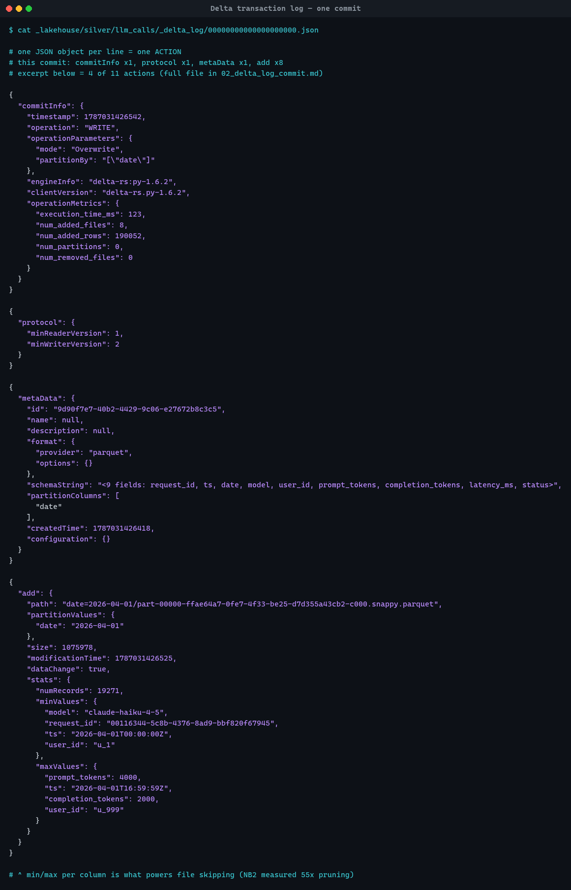

# Evidence 2 — contents of one `_delta_log/*.json`



Table: `_lakehouse/silver/llm_calls` (NB4 Silver) · commit
`_delta_log/00000000000000000000.json` (v0) · captured 2026-08-18 05:40 UTC.

Each line of the file is one **action**. A commit is the atomic rename of this
JSON into `_delta_log/`; readers replay the actions in order, so a half-written
commit is simply a file that never got renamed and is never seen. That is the
whole of Delta's ACID mechanism.

| Action | Count | What it does |
|---|---:|---|
| `commitInfo` | 1 | Who/what/when — the row `history()` surfaces |
| `protocol` | 1 | Min reader/writer version a client must support |
| `metaData` | 1 | Schema, partition columns, format |
| `add` | 8 | One per data file, **with min/max stats** — the basis of file skipping |

The screenshot shows 4 of 11 actions; the full commit follows, with the
embedded `stats` string expanded so the min/max values are readable.

```json
{
  "commitInfo": {
    "timestamp": 1787031426542,
    "operation": "WRITE",
    "operationParameters": {
      "mode": "Overwrite",
      "partitionBy": "[\"date\"]"
    },
    "engineInfo": "delta-rs:py-1.6.2",
    "clientVersion": "delta-rs.py-1.6.2",
    "operationMetrics": {
      "execution_time_ms": 123,
      "num_added_files": 8,
      "num_added_rows": 190052,
      "num_partitions": 0,
      "num_removed_files": 0
    }
  }
}
{
  "protocol": {
    "minReaderVersion": 1,
    "minWriterVersion": 2
  }
}
{
  "metaData": {
    "id": "9d90f7e7-40b2-4429-9c06-e27672b8c3c5",
    "name": null,
    "description": null,
    "format": {
      "provider": "parquet",
      "options": {}
    },
    "schemaString": "{\"type\":\"struct\",\"fields\":[{\"name\":\"request_id\",\"type\":\"string\",\"nullable\":true,\"metadata\":{}},{\"name\":\"ts\",\"type\":\"timestamp\",\"nullable\":true,\"metadata\":{}},{\"name\":\"date\",\"type\":\"date\",\"nullable\":true,\"metadata\":{}},{\"name\":\"model\",\"type\":\"string\",\"nullable\":true,\"metadata\":{}},{\"name\":\"user_id\",\"type\":\"string\",\"nullable\":true,\"metadata\":{}},{\"name\":\"prompt_tokens\",\"type\":\"integer\",\"nullable\":true,\"metadata\":{}},{\"name\":\"completion_tokens\",\"type\":\"integer\",\"nullable\":true,\"metadata\":{}},{\"name\":\"latency_ms\",\"type\":\"integer\",\"nullable\":true,\"metadata\":{}},{\"name\":\"status\",\"type\":\"string\",\"nullable\":true,\"metadata\":{}}]}",
    "partitionColumns": [
      "date"
    ],
    "createdTime": 1787031426418,
    "configuration": {}
  }
}
{
  "add": {
    "path": "date=2026-04-01/part-00000-ffae64a7-0fe7-4f33-be25-d7d355a43cb2-c000.snappy.parquet",
    "partitionValues": {
      "date": "2026-04-01"
    },
    "size": 1075978,
    "modificationTime": 1787031426525,
    "dataChange": true,
    "stats": {
      "numRecords": 19271,
      "minValues": {
        "model": "claude-haiku-4-5",
        "request_id": "00116344-5c8b-4376-8ad9-bbf820f67945",
        "ts": "2026-04-01T00:00:00Z",
        "user_id": "u_1",
        "completion_tokens": 20,
        "prompt_tokens": 50,
        "latency_ms": 50,
        "status": "error"
      },
      "maxValues": {
        "prompt_tokens": 4000,
        "ts": "2026-04-01T16:59:59Z",
        "completion_tokens": 2000,
        "user_id": "u_999",
        "latency_ms": 8103,
        "request_id": "fffd990f-9321-4364-b6e1-b915dc5a2dfe",
        "status": "rate_limited",
        "model": "claude-sonnet-4-6"
      },
      "nullCount": {
        "prompt_tokens": 0,
        "completion_tokens": 0,
        "model": 0,
        "user_id": 0,
        "latency_ms": 0,
        "ts": 0,
        "request_id": 0,
        "status": 0
      }
    },
    "tags": null,
    "baseRowId": null,
    "defaultRowCommitVersion": null,
    "clusteringProvider": null
  }
}
{
  "add": {
    "path": "date=2026-04-06/part-00000-1d09ce77-2e3a-44a8-a906-31598d46b051-c000.snappy.parquet",
    "partitionValues": {
      "date": "2026-04-06"
    },
    "size": 1490512,
    "modificationTime": 1787031426526,
    "dataChange": true,
    "stats": {
      "numRecords": 27152,
      "minValues": {
        "latency_ms": 50,
        "prompt_tokens": 50,
        "ts": "2026-04-05T17:00:00Z",
        "status": "error",
        "request_id": "0000097f-462f-4fec-8dd3-3723d5fb22c3",
        "completion_tokens": 20,
        "user_id": "u_1",
        "model": "claude-haiku-4-5"
      },
      "maxValues": {
        "completion_tokens": 2000,
        "ts": "2026-04-06T16:59:59Z",
        "prompt_tokens": 4000,
        "latency_ms": 8380,
        "model": "claude-sonnet-4-6",
        "status": "rate_limited",
        "request_id": "fffed799-ac18-42a3-96c0-dfaf0a83475e",
        "user_id": "u_999"
      },
      "nullCount": {
        "user_id": 0,
        "ts": 0,
        "status": 0,
        "completion_tokens": 0,
        "model": 0,
        "request_id": 0,
        "latency_ms": 0,
        "prompt_tokens": 0
      }
    },
    "tags": null,
    "baseRowId": null,
    "defaultRowCommitVersion": null,
    "clusteringProvider": null
  }
}
{
  "add": {
    "path": "date=2026-04-08/part-00000-4396ef30-964d-465c-a580-607afc189b5a-c000.snappy.parquet",
    "partitionValues": {
      "date": "2026-04-08"
    },
    "size": 467485,
    "modificationTime": 1787031426531,
    "dataChange": true,
    "stats": {
      "numRecords": 7915,
      "minValues": {
        "ts": "2026-04-07T17:00:01Z",
        "user_id": "u_1",
        "completion_tokens": 20,
        "prompt_tokens": 50,
        "request_id": "0005b243-f515-48de-8fe6-067709c10862",
        "model": "claude-haiku-4-5",
        "latency_ms": 50,
        "status": "error"
      },
      "maxValues": {
        "prompt_tokens": 4000,
        "user_id": "u_999",
        "latency_ms": 7398,
        "completion_tokens": 2000,
        "model": "claude-sonnet-4-6",
        "ts": "2026-04-07T23:59:56Z",
        "status": "rate_limited",
        "request_id": "fffee95c-4a93-4f5b-bfd4-564a3be6562f"
      },
      "nullCount": {
        "completion_tokens": 0,
        "prompt_tokens": 0,
        "user_id": 0,
        "status": 0,
        "model": 0,
        "latency_ms": 0,
        "ts": 0,
        "request_id": 0
      }
    },
    "tags": null,
    "baseRowId": null,
    "defaultRowCommitVersion": null,
    "clusteringProvider": null
  }
}
{
  "add": {
    "path": "date=2026-04-04/part-00000-7455510c-e5bc-445a-8398-580a5d5dc723-c000.snappy.parquet",
    "partitionValues": {
      "date": "2026-04-04"
    },
    "size": 1491626,
    "modificationTime": 1787031426531,
    "dataChange": true,
    "stats": {
      "numRecords": 27176,
      "minValues": {
        "request_id": "000cff6c-81f6-4672-9e0a-7a26eb554ebf",
        "ts": "2026-04-03T17:00:00Z",
        "status": "error",
        "latency_ms": 50,
        "prompt_tokens": 50,
        "user_id": "u_1",
        "completion_tokens": 20,
        "model": "claude-haiku-4-5"
      },
      "maxValues": {
        "request_id": "fffc894c-0423-41ac-a6ae-3ccd2183051e",
        "completion_tokens": 2000,
        "user_id": "u_999",
        "model": "claude-sonnet-4-6",
        "status": "rate_limited",
        "ts": "2026-04-04T16:59:58Z",
        "prompt_tokens": 4000,
        "latency_ms": 7430
      },
      "nullCount": {
        "status": 0,
        "model": 0,
        "latency_ms": 0,
        "prompt_tokens": 0,
        "user_id": 0,
        "completion_tokens": 0,
        "request_id": 0,
        "ts": 0
      }
    },
    "tags": null,
    "baseRowId": null,
    "defaultRowCommitVersion": null,
    "clusteringProvider": null
  }
}
{
  "add": {
    "path": "date=2026-04-07/part-00000-77153fb7-fede-42d3-8710-72cf1e51c9b3-c000.snappy.parquet",
    "partitionValues": {
      "date": "2026-04-07"
    },
    "size": 1487839,
    "modificationTime": 1787031426532,
    "dataChange": true,
    "stats": {
      "numRecords": 27112,
      "minValues": {
        "latency_ms": 50,
        "status": "error",
        "prompt_tokens": 50,
        "model": "claude-haiku-4-5",
        "request_id": "000218e7-424c-457c-8cda-81558380b869",
        "ts": "2026-04-06T17:00:02Z",
        "completion_tokens": 20,
        "user_id": "u_1"
      },
      "maxValues": {
        "model": "claude-sonnet-4-6",
        "ts": "2026-04-07T16:59:54Z",
        "request_id": "fffb21db-c921-4e48-9f14-3951a45e1eb4",
        "prompt_tokens": 4000,
        "completion_tokens": 2000,
        "status": "rate_limited",
        "user_id": "u_999",
        "latency_ms": 8458
      },
      "nullCount": {
        "ts": 0,
        "request_id": 0,
        "status": 0,
        "model": 0,
        "prompt_tokens": 0,
        "user_id": 0,
        "latency_ms": 0,
        "completion_tokens": 0
      }
    },
    "tags": null,
    "baseRowId": null,
    "defaultRowCommitVersion": null,
    "clusteringProvider": null
  }
}
{
  "add": {
    "path": "date=2026-04-02/part-00000-1ab671c6-ec35-4aad-8309-1be9cb075e12-c000.snappy.parquet",
    "partitionValues": {
      "date": "2026-04-02"
    },
    "size": 1492458,
    "modificationTime": 1787031426532,
    "dataChange": true,
    "stats": {
      "numRecords": 27199,
      "minValues": {
        "request_id": "000236fd-e89f-4cc5-9a9f-1b97133ae3de",
        "status": "error",
        "user_id": "u_1",
        "ts": "2026-04-01T17:00:02Z",
        "completion_tokens": 20,
        "model": "claude-haiku-4-5",
        "latency_ms": 50,
        "prompt_tokens": 50
      },
      "maxValues": {
        "request_id": "fffe3d89-8203-4975-977a-8c4fc8f44e15",
        "model": "claude-sonnet-4-6",
        "completion_tokens": 2000,
        "status": "rate_limited",
        "user_id": "u_999",
        "ts": "2026-04-02T16:59:58Z",
        "prompt_tokens": 4000,
        "latency_ms": 8278
      },
      "nullCount": {
        "user_id": 0,
        "completion_tokens": 0,
        "prompt_tokens": 0,
        "request_id": 0,
        "status": 0,
        "model": 0,
        "ts": 0,
        "latency_ms": 0
      }
    },
    "tags": null,
    "baseRowId": null,
    "defaultRowCommitVersion": null,
    "clusteringProvider": null
  }
}
{
  "add": {
    "path": "date=2026-04-05/part-00000-fb6d31f2-d46d-4024-b2b0-0eb9615a5293-c000.snappy.parquet",
    "partitionValues": {
      "date": "2026-04-05"
    },
    "size": 1496031,
    "modificationTime": 1787031426541,
    "dataChange": true,
    "stats": {
      "numRecords": 27131,
      "minValues": {
        "status": "error",
        "ts": "2026-04-04T17:00:01Z",
        "request_id": "000143d9-e5f8-44b4-9f37-4884f1785014",
        "user_id": "u_1",
        "prompt_tokens": 50,
        "model": "claude-haiku-4-5",
        "completion_tokens": 20,
        "latency_ms": 50
      },
      "maxValues": {
        "user_id": "u_999",
        "request_id": "ffffe1f2-94e3-419f-a925-54e3b890986d",
        "prompt_tokens": 4000,
        "completion_tokens": 2000,
        "latency_ms": 7632,
        "ts": "2026-04-05T16:59:57Z",
        "status": "rate_limited",
        "model": "claude-sonnet-4-6"
      },
      "nullCount": {
        "prompt_tokens": 0,
        "ts": 0,
        "status": 0,
        "model": 0,
        "latency_ms": 0,
        "completion_tokens": 0,
        "request_id": 0,
        "user_id": 0
      }
    },
    "tags": null,
    "baseRowId": null,
    "defaultRowCommitVersion": null,
    "clusteringProvider": null
  }
}
{
  "add": {
    "path": "date=2026-04-03/part-00000-b454ecef-745b-4906-b2eb-90c530c7cc57-c000.snappy.parquet",
    "partitionValues": {
      "date": "2026-04-03"
    },
    "size": 1487064,
    "modificationTime": 1787031426541,
    "dataChange": true,
    "stats": {
      "numRecords": 27096,
      "minValues": {
        "status": "error",
        "request_id": "0006b400-4122-4080-8e67-649f59e8eb2d",
        "user_id": "u_1",
        "ts": "2026-04-02T17:00:01Z",
        "prompt_tokens": 50,
        "latency_ms": 50,
        "completion_tokens": 20,
        "model": "claude-haiku-4-5"
      },
      "maxValues": {
        "status": "rate_limited",
        "completion_tokens": 2000,
        "model": "claude-sonnet-4-6",
        "ts": "2026-04-03T16:59:54Z",
        "user_id": "u_999",
        "request_id": "fffd0415-df8d-440a-9a90-6cbb845c0948",
        "prompt_tokens": 4000,
        "latency_ms": 7595
      },
      "nullCount": {
        "latency_ms": 0,
        "completion_tokens": 0,
        "request_id": 0,
        "status": 0,
        "ts": 0,
        "user_id": 0,
        "model": 0,
        "prompt_tokens": 0
      }
    },
    "tags": null,
    "baseRowId": null,
    "defaultRowCommitVersion": null,
    "clusteringProvider": null
  }
}
```
