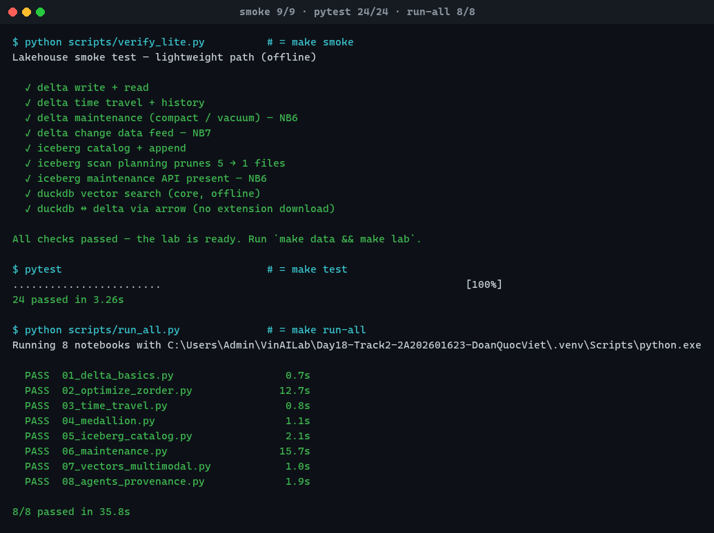

# Evidence 3 — the three grading gates



Windows 11 · Python 3.11.8 · deltalake 1.6.2 · pyiceberg 0.11.1 · duckdb 1.5.5 · polars 1.43.2 · pyarrow 25.0.1  
Captured 2026-08-18 05:40 UTC.

`make` is not installed on this machine, so each target was run as its literal
recipe from the [Makefile](../../Makefile) against the venv interpreter:

| Make target | Command run | Result |
|---|---|---|
| `make smoke` | `python scripts/verify_lite.py` | 9/9 |
| `make test` | `pytest` | 24/24 |
| `make run-all` | `python scripts/run_all.py` | 8/8 in 35.8s |

> The rubric says "22 tests"; this checkout has 24. The two extra are the
> regression tests the README describes — NB4 self-generating its Bronze input,
> and per-notebook Iceberg catalog isolation.

```
$ python scripts/verify_lite.py          # = make smoke
Lakehouse smoke test — lightweight path (offline)

  ✓ delta write + read
  ✓ delta time travel + history
  ✓ delta maintenance (compact / vacuum) — NB6
  ✓ delta change data feed — NB7
  ✓ iceberg catalog + append
  ✓ iceberg scan planning prunes 5 → 1 files
  ✓ iceberg maintenance API present — NB6
  ✓ duckdb vector search (core, offline)
  ✓ duckdb ↔ delta via arrow (no extension download)

All checks passed — the lab is ready. Run `make data && make lab`.

$ pytest                                 # = make test
........................                                                 [100%]
24 passed in 3.26s

$ python scripts/run_all.py              # = make run-all
Running 8 notebooks with C:\Users\Admin\VinAILab\Day18-Track2-2A202601623-DoanQuocViet\.venv\Scripts\python.exe

  PASS  01_delta_basics.py                  0.7s
  PASS  02_optimize_zorder.py              12.7s
  PASS  03_time_travel.py                   0.8s
  PASS  04_medallion.py                     1.1s
  PASS  05_iceberg_catalog.py               2.1s
  PASS  06_maintenance.py                  15.7s
  PASS  07_vectors_multimodal.py            1.0s
  PASS  08_agents_provenance.py             1.9s

8/8 passed in 35.8s
```
